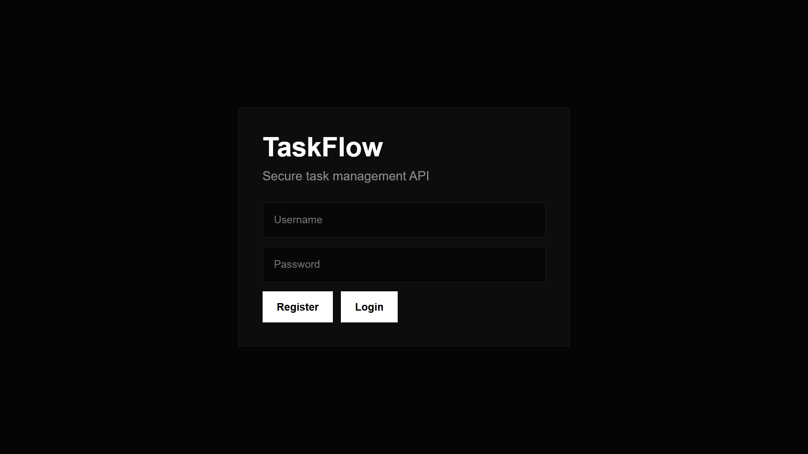
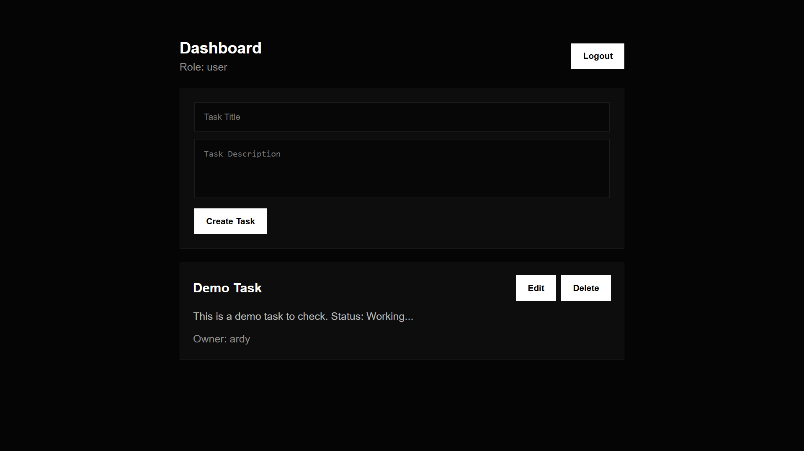
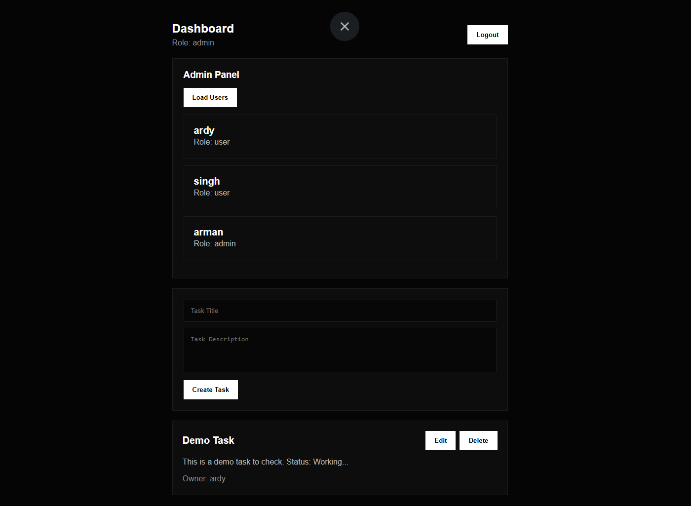
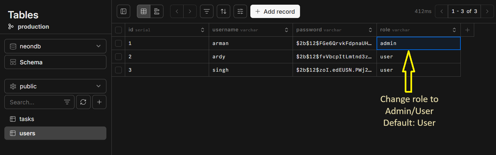

# TaskFlow API

TaskFlow API is a scalable task management backend built using FastAPI, PostgreSQL, JWT Authentication, and Role-Based Access Control.

The project includes a minimal frontend dashboard for interacting with APIs and testing authentication, CRUD operations, and admin features.

---

## Login & Register

Users can create accounts and securely log in using JWT authentication.

---

## Features

- User Registration & Login
- JWT Authentication
- Role-Based Access Control (User/Admin)
- Task CRUD Operations
- PostgreSQL Database Integration
- Protected API Routes
- Admin-only APIs
- Swagger API Documentation
- Minimal Frontend Dashboard
- Structured Backend Architecture

---

## User Dashboard

Normal users can:
- Create tasks
- Edit tasks
- Delete tasks
- View only their own tasks

---

## Admin Dashboard

Admins can:
- View all users
- Access all tasks
- Manage all user tasks

Admin accounts are managed manually through the database for security purposes.

---

## Database

The project uses PostgreSQL for database management. Neon cloud PostgreSQL was used during development, but local PostgreSQL setups are also supported.

Role values can be managed directly from the database.

---

## Tech Stack

### Backend
- FastAPI
- PostgreSQL
- SQLAlchemy
- JWT Authentication
- Passlib

### Frontend
- HTML
- CSS
- Vanilla JavaScript

---

## Project Structure

TASKFLOW/

├── app/

│   ├── auth.py

│   ├── config.py

│   ├── database.py

│   ├── dependencies.py

│   ├── main.py

│   ├── models.py

│   ├── schemas.py

│   └── tasks.py

│

├── frontend/

│   ├── index.html

│   ├── dashboard.html

│   ├── style.css

│   └── app.js

│

├── Docs/

│   ├── Login-Register.png

│   ├── User_dashboard.png

│   ├── Admin_Dashboard.png

│   └── Db_table.png

│

├── .env

├── requirements.txt

└── README.md

---

## Installation

Clone the repository:

git clone https://github.com/Arman-0909/TaskFlow

Move into project folder:

cd TASKFLOW

Install dependencies:

pip install -r requirements.txt

---

## Environment Variables

Create a `.env` file in root directory:

DATABASE_URL=YOUR_DATABASE_URL

SECRET_KEY=your_secret_key

ALGORITHM=HS256

---

## Run Backend

uvicorn app.main:app --reload

Backend URL:

http://127.0.0.1:8000

Swagger Docs:

http://127.0.0.1:8000/docs

---

## Run Frontend

Open:

frontend/index.html

in browser.

---

## API Features

### Authentication
- Register User
- Login User
- JWT Token Generation

### Tasks
- Create Task
- Read Task
- Update Task
- Delete Task

### Admin
- View All Users
- View All Tasks

---

## Scalability Notes

This project follows a modular backend architecture that supports future scalability.

Possible future improvements:
- Docker deployment
- Redis caching
- Microservices architecture
- Rate limiting
- CI/CD pipelines
- Load balancing
- Async background jobs

